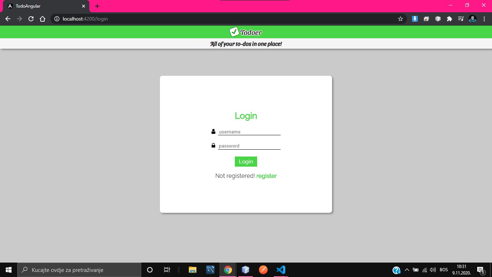
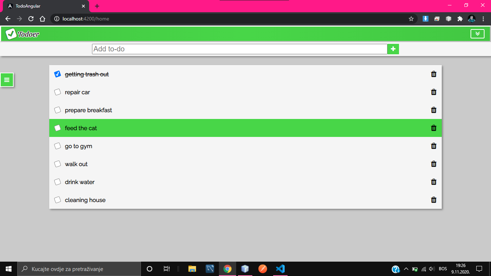
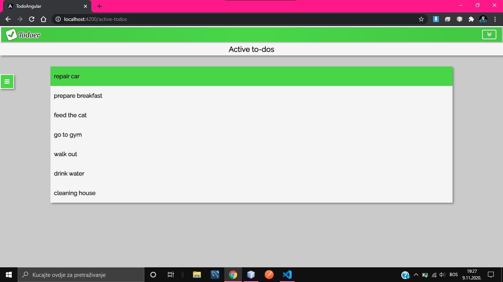
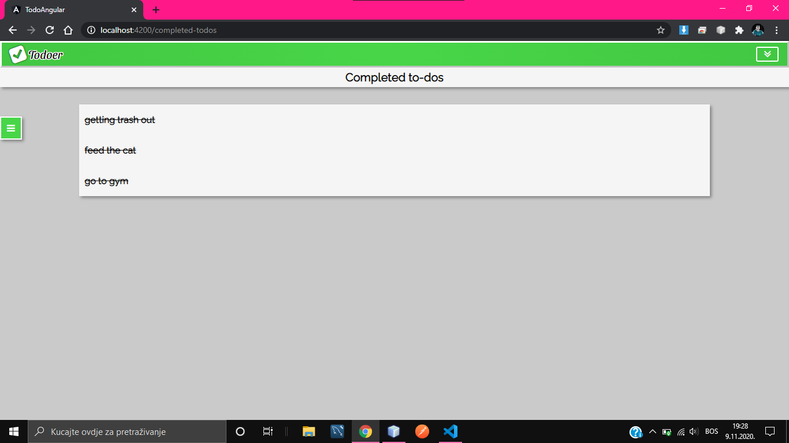
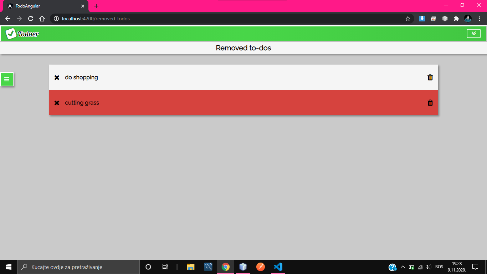
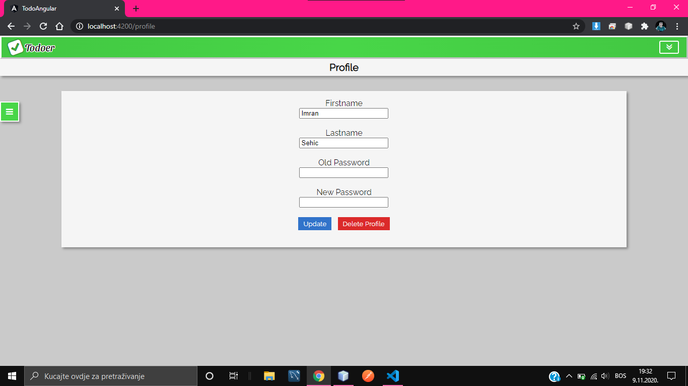
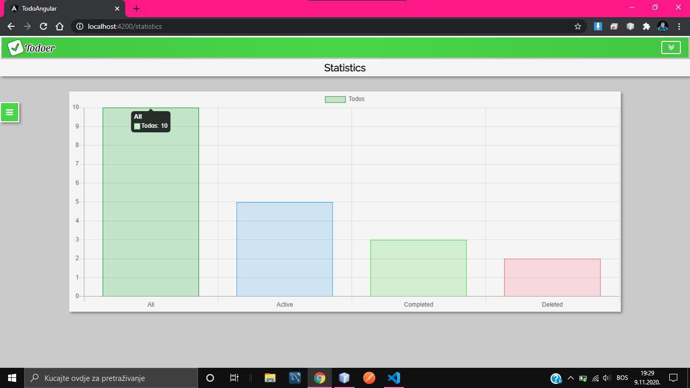
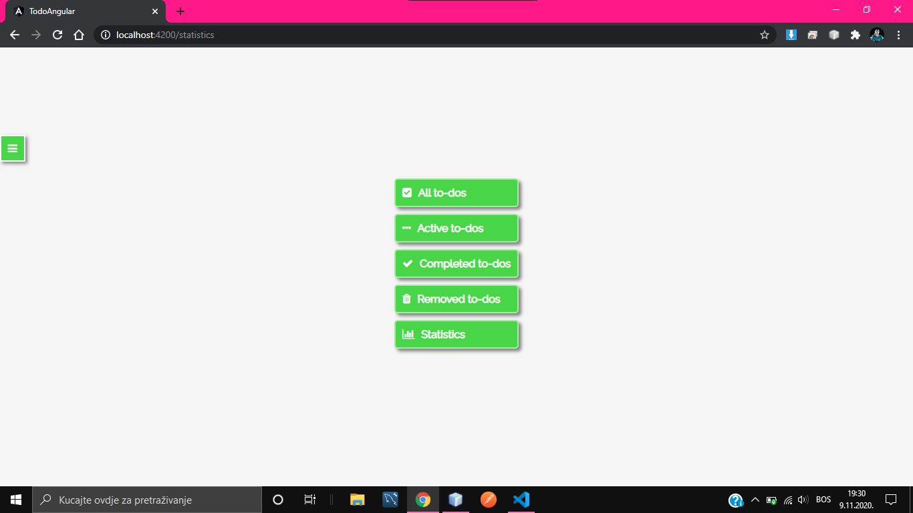

# todo-app-angular

This is the frontend for a simple todo application built in Angular with TypeScript. 
The application contains the following pages: 
* login
* register
* all-todos
* active-todos
* completed todos
* removed todos
* user-profile
* statistics

<!-- -->

The backend is built using Spring Boot, the most popular Java Framework and is available under the following link: <a href="https://github.com/Imran-Sehic/todo-spring-boot">Here</a>, while the database used is MySQL. 
Below are some of the screenshots of the application.  
## 1.Login

 

## 2.All-todos

 

## 3.Active-todos

 

## 4.Completed-todos

 

## 5.Removed-todos

 

## 6.User-profile

 

## 7.Statistics

 

## 8.Navigation

 
